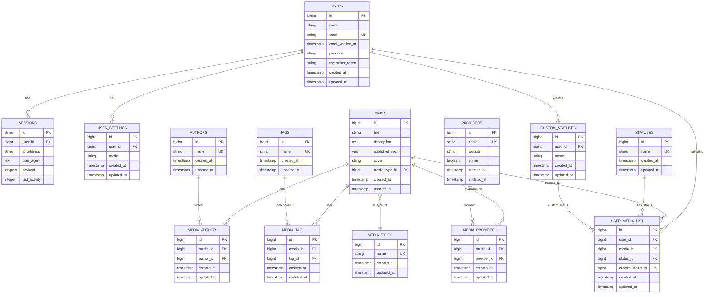

# Entity Relationship Diagram (ERD)

## Database Schema Overview

This document provides an overview of the database structure for MyMangaShelf application.

## Table Descriptions

### Core User Tables

#### **USERS**
Main user account table. Stores user credentials and profile information.
- **Primary Key**: id
- **Unique Constraints**: email
- **Relationships**: Sessions, UserSettings, CustomStatuses, UserMediaList

#### **SESSIONS**
Session tracking table for active user sessions.
- **Foreign Keys**: user_id → users.id
- **Cascade**: Delete on user deletion

#### **USER_SETTINGS**
User-specific application settings.
- **Foreign Keys**: user_id → users.id (1:1 relationship)
- **Fields**: mode (light/dark theme preference)
- **Cascade**: Delete on user deletion

### Media Library Tables

#### **MEDIA**
Core media content table for manga, light novels, anime, etc.
- **Foreign Keys**: media_type_id → media_types.id
- **Relationships**: Multiple media can have authors, tags, providers

#### **MEDIA_TYPES**
Reference table for types (Manga, Anime, Light Novel, etc.)
- **Unique Constraints**: name

#### **AUTHORS**
Reference table for media authors/creators.
- **Unique Constraints**: name
- **Relationships**: Many-to-many with Media through media_author table

#### **TAGS**
Reference table for content categories (Action, Romance, etc.).
- **Unique Constraints**: name
- **Relationships**: Many-to-many with Media through media_tag table

#### **PROVIDERS**
Reference table for streaming/reading platforms.
- **Fields**: website, online (availability status)
- **Unique Constraints**: name
- **Relationships**: Many-to-many with Media through media_provider table

### Junction Tables (Many-to-Many)

#### **MEDIA_AUTHOR**
Links media to authors. Supports multiple authors per media and multiple media per author.
- **Composite Unique**: (media_id, author_id)
- **Cascade**: Delete on media or author deletion

#### **MEDIA_TAG**
Links media to tags. Supports multiple tags per media.
- **Composite Unique**: (media_id, tag_id)
- **Cascade**: Delete on media or tag deletion

#### **MEDIA_PROVIDER**
Links media to providers. Shows where media is available.
- **Composite Unique**: (media_id, provider_id)
- **Cascade**: Delete on media or provider deletion

### User Tracking Tables

#### **CUSTOM_STATUSES**
User-defined status types for personalizing their media tracking.
- **Foreign Keys**: user_id → users.id
- **Composite Unique**: (user_id, name)
- **Cascade**: Delete on user deletion

#### **STATUSES**
Predefined default statuses (Plan to Watch, Watching, Completed, etc.).
- **Unique Constraints**: name

#### **USER_MEDIA_LIST**
User's personal media tracking list with status information.
- **Foreign Keys**:
  - user_id → users.id
  - media_id → media.id
  - status_id → statuses.id (default: 1)
  - custom_status_id → custom_statuses.id (nullable)
- **Composite Unique**: (user_id, media_id) - Prevents duplicate entries
- **Cascade**: Delete on user or media deletion

### Authentication Tables

#### **PASSWORD_RESET_TOKENS**
Temporary tokens for password reset functionality.
- **Primary Key**: email
- **Fields**: token, created_at

## Key Relationships

### One-to-Many
- **Users → Sessions**: A user can have multiple sessions
- **Users → UserSettings**: A user has one settings record
- **Users → CustomStatuses**: A user can create multiple custom statuses
- **Users → UserMediaList**: A user can track multiple media items
- **MediaTypes → Media**: A media type can have multiple media
- **Authors → MediaAuthor**: An author can write multiple media
- **Tags → MediaTag**: A tag can categorize multiple media
- **Providers → MediaProvider**: A provider can offer multiple media
- **Statuses → UserMediaList**: A status can be used in multiple user lists
- **CustomStatuses → UserMediaList**: A custom status can be used multiple times

### Many-to-Many
- **Media ↔ Authors** (through media_author)
- **Media ↔ Tags** (through media_tag)
- **Media ↔ Providers** (through media_provider)

## Cascade Behaviors

### Delete Cascading
When a parent record is deleted:
- Deleting a **User** cascades to: Sessions, UserSettings, CustomStatuses, UserMediaList
- Deleting **Media** cascades to: MediaAuthor, MediaTag, MediaProvider, UserMediaList
- Deleting **Authors/Tags/Providers/Statuses** cascades to junction/tracking tables

### Null on Delete
- `UserMediaList.custom_status_id` → Set to NULL when custom status is deleted
- `Media.media_type_id` → Set to NULL when media type is deleted

## Generated At
May 21, 2026
